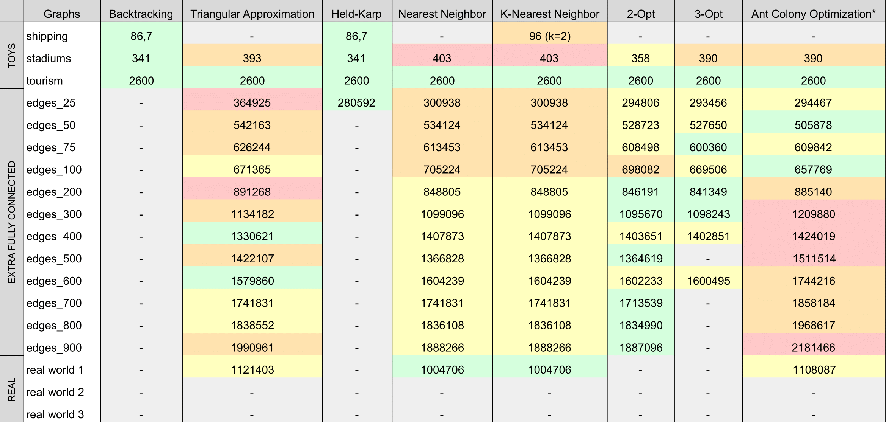
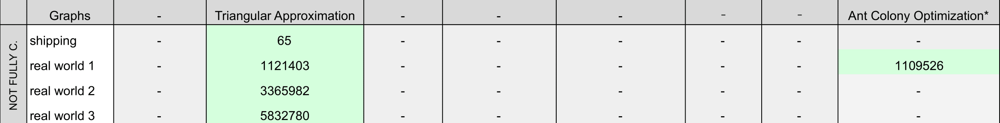
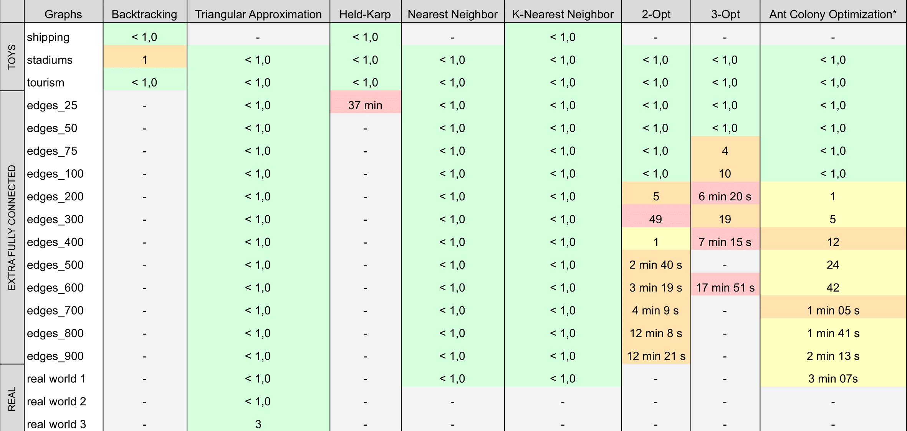

# TSP - Traveling Salesman Problem

## Description
This project enables comparison between different solutions for the Traveling Salesman Problem (TSP), a renowned challenge in combinatorial optimization. The objective is to determine the shortest route that visits each city exactly once and returns to the starting city. Being [NP-hard](https://en.wikipedia.org/wiki/NP-hardness), the TSP lacks a polynomial-time solution algorithm.

## Dataset
There are provided datasets in the 'data' folder, which are used to test the algorithms.
In total, there are 18 graphs: 3 are small __toy graphs__, 12 are medium-sized __fully connected graphs__ and 3 are scaled-down versions of __real world graphs__.

Regarding the 3 real-world graphs in this dataset we have the following edge and node statistics:
- __Graph 1__: 1K nodes and ~ 500K edges
- __Graph 2__: 5K nodes and ~ 4M edges
- __Graph 3__: 10K nodes and ~ 20M edges

## Algorithms

### Backtracking
- Brute force algorithm that explores all possible routes.
- __🚀 Time Complexity:__ O(V!), where V is the number of vertices in the graph. 

### Triangular Approximation
- Creates a MST using Prim's algorithm and traverses it using a DFS.
- __🚀 Time Complexity:__ O((V+E) logV), where V is the number of vertices and E is the number of edges in the graph.

### Nearest Neighbor
- Greedy algorithm that selects the nearest unvisited vertex to the current vertex.
- __🚀 Time Complexity:__ O(V^2), where V is the number of vertices in the graph.

### K-Nearest Neighbor
- Greedy algorithm that selects the k nearest unvisited vertices to the current vertex.
- __🚀 Time Complexity:__ O(V^2 * logV + V * k), where V is the number of vertices in the graph.
  
💡 Tips: Increasing the value of K provides better chance to find a feasible path. However, the larger is K, the longer computation time is to complete the traversal.

### 2-Opt
- Give a solution path and iteratively swaps two edges to reduce the total distance of the path.
- __🚀 Time Complexity:__ O(V^2), where V is the number of vertices in the graph.

### 3-Opt
- Give a solution path and iteratively swaps three edges to reduce the total distance of the path.
- __🚀 Time Complexity:__ O(V^3), where V is the number of vertices in the graph.
  
📝 Note: The Opt algorithms that we implemented, uses as initial solution the nearest neighbor algorithm (NNA). Which means that the time complexity of the Opt algorithms is `max(Opt, NNA)`.

### Held-Karp
- Dynamic programming algorithm that uses the concept of state and transition.
- __🚀 Time Complexity:__ O(2^V * V^2), where V is the number of vertices in the graph.

### Ant Colony Optimization (ACO)
- Probabilistic technique that simulates the behavior of ants in finding paths from the colony to food.
- __🚀 Time Complexity:__ O(V^2 * numAnts * numIterations), where V is the number of vertices in the graph, numAnts is the number of ants, and numIterations is the number of iterations.

### TSP in Real World
We tailored the Triangular Approximation, Nearest Neighbor Algorithm (NNA), K-Nearest Neighbor (K-NN), and Ant Colony Optimization (ACO) to tackle real-world TSP scenarios. Users now have the flexibility to __select__ the starting vertex and determine whether to treat the graph as fully connected or not.

With these adjustments, our algorithms provide solutions even when the graphs __may not be fully connected__, by returning `feasible` or `not feasible`, ensuring that a solution is always provided.

## Results
Comparison of the time and costs of different TSP algorithms:

<b>Distance (m) - Considering graphs as how they are</b>

> k-nearest neighbor is by default K = 1
> 
> *ACO considering 10 ants, 10 iterations, α = 1.0, β = 5.0, evaporationRate = 0.5
> 
> blank cells indicates N/A or TLE

 

<b>Distance (m) - Considering graphs as fully connected</b>

> This table is intended to record the results of algorithms capable of providing solutions for non-fully connected graphs, utilizing the [Haversine distance formula](https://en.wikipedia.org/wiki/Haversine_formula).

 

<b>Average Execution Time (s)</b>

## Reflection

Both the Triangular Approximation and Nearest Neighbor Algorithms (NNA) demonstrate speed and efficacy, with the NNA edging slightly ahead providing marginally superior results in large dataset. Overall, both algorithms perfom incredibly well

Even though the 3-opt heuristic takes more time than the 2-opt heuristic, it doesn't consistently yield better results. From this observation, we can conclude that it's not an effective algorithm in this scenario.

The 2-Opt is very good for small dataset which always provides a better solution than Nearest Neighbor Algorithm (NNA). However, as the dataset grows larger, it becomes impractial due to its exponential increase in execution time.

The Ant Colony Optimization (ACO) algorithm performs well on larger datasets and is able to find good solutions due to its probabilistic nature and the use of both pheromone trails and heuristic information. However, the time complexity is dependent on the number of ants and iterations, which can be a limiting factor for very large problems or for a very high number of ants or iterations.
With a greater number of ants and iterations, we could potentially get more optimal solutions, but the time to run the algorithm would also increase.

## Documentation
Find the complete documentation in the [Doxygen HTML documentation](docs/output/index.html).

## Main Contributors
- Ricardo Yang (up202208465@fe.up.pt)
- Bruno Huang (up202207517@fe.up.pt)

 

__This project was developed for [DA](https://sigarra.up.pt/feup/en/UCURR_GERAL.FICHA_UC_VIEW?pv_ocorrencia_id=520321) at @FEUP__
